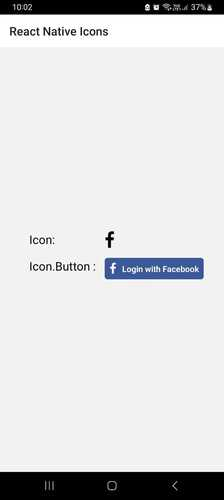

### React Native Drawer Navigation Example

## Installation
Files edited:
1. android\app\build.gradle  
:169 implementation project(':react-native-vector-icons')  
:174 apply from: "../../node_modules/react-native-vector-icons/fonts.gradle"

2. android\settings.gradle  
:5 include ':react-native-vector-icons'  
:6 project(':react-native-vector-icons').projectDir = new File(rootProject.projectDir, '../node_modules/react-native-vector-icons/android')  

3. App.tsx

## Run on emulator
> yarn android

## License

React-native-vector-icons library is licensed under [The MIT License](LICENSE).

## Credits
Regarding main project 'react-native-vector-icons' library', please refer to 'https://github.com/oblador/react-native-vector-icons'